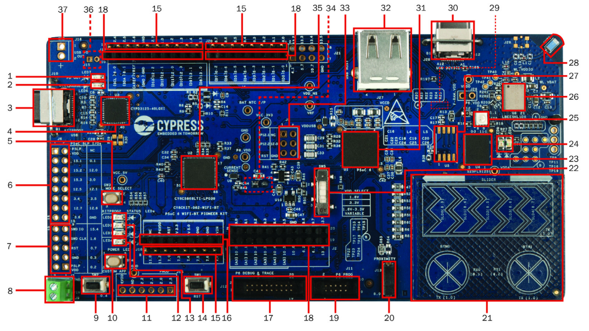
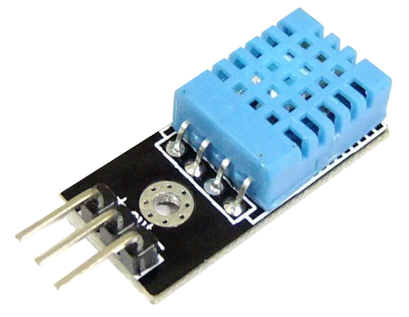
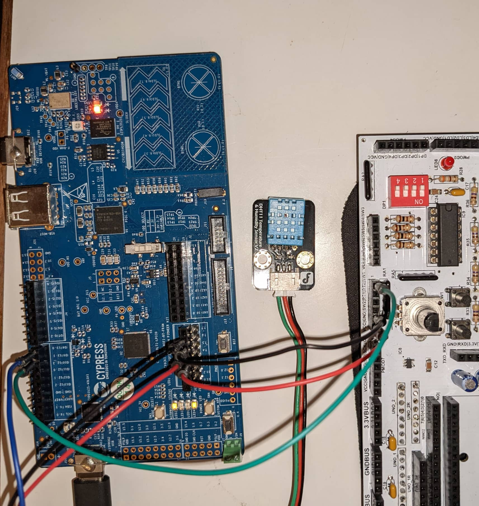

# IoT

**Data is collected using an embedded device connected to the IoT. This data is forwarded to a mySQL database. A web application collects the data from the database and presents it.**

## EMBEDDED DEVICE
### PSoC 6 WiFi-BT Pioneer Kit

- 35: programmer and debugger
- 3: USB Type-C programming connector
- 31: Cypress PSoC 6 
- 26: 2.4-GHz WLAN and Bluetooth functionality (LBEE5KL 1DX, U6)

### SENSOR
DHT11 sensor is used for measuring temperature and humidity. They are made of two parts, a capacitive humidity sensor and a thermistor. There is also a very basic chip inside that does some analog to digital conversion and spits out a digital signal with the temperature and humidity. Using bitbanging to read the values.

- 3 to 5V power and I/O
- Good for 20-80% humidity readings with 5% accuracy
- Good for 0-50°C temperature readings ±2°C accuracy
- No more than 1 Hz sampling rate (once every second)
- click [here](https://www.mouser.com/datasheet/2/758/DHT11-Technical-Data-Sheet-Translated-Version-1143054.pdf) for the datasheet

## application:

- http://12001510.pxl-ea-ict.be/IOT/project/index.php

## data collection
*collecting data atm*

To keep continuity between the data, both temperature and humidity is collected on interval. It is also possible to trigger an individual element using a push button event.

**on interval:**
Every hour temperature and humidity is sent to the database with an offset of 30min between them.

**on event:**
Temperature can be sent using "SW2" button on the psoc. Also humidity can be sent using a pushbutton event, but there is only 1 on psoc button. So an external button on a developer board is used on the GPIO pins of the psoc.

## setup:

**on the left is the PSOC, in the middle the DHT11 sensor/chip and on the right the developer board for external button.**

## TO-DO
- back button
- jquert sort table data

## SOURCES:

### CSS:
- https://www.youtube.com/watch?v=fYq5PXgSsbE&ab_channel=WebDevSimplified

### SQL:
- https://www.youtube.com/watch?v=fXpjwSFgoV0
- https://www.youtube.com/watch?v=Bn-nTzkhEpQ
- https://www.youtube.com/watch?v=cepspxPAUTA
- https://www.youtube.com/watch?v=QY4bVNL_yrI
- https://www.youtube.com/watch?v=HXV3zeQKqGY&t=8499s

### PHP:
- https://www.youtube.com/watch?v=SNcMF_-4M4A&ab_channel=LampCamp
- https://www.youtube.com/watch?v=qVU3V0A05k8&list=PL0eyrZgxdwhwBToawjm9faF1ixePexft-
- https://www.youtube.com/watch?v=a7_WFUlFS94

### javaScript:
- https://www.youtube.com/watch?v=LFa9fnQGb3g&ab_channel=blondiebytes
- https://www.youtube.com/watch?v=yGnjK8dqhjk&ab_channel=CurlyBrackets

### Chart.js
- https://www.youtube.com/watch?v=fqARSwfsV9w&ab_channel=DevEd
- https://www.youtube.com/watch?v=cREXtrFiJBc&ab_channel=Madsycode
- https://www.youtube.com/watch?v=H1y66SPBlRI&t=1043s&ab_channel=ExcellenceinExcel
