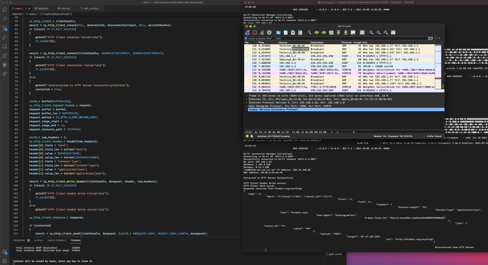

**Omdat git in modustoolbox programma's moeilijk doet schrijf ik in deze readme wat ik de voorbije dagen heb gedaan**

Elke gebruikte library heeft een .git dus doet moeilijk over nested gits enzo, weet nog niet hoe ik dit proper ga oplossen.

Ik ben 2 dagen bezig geweest met de PSOC6 te verbinden met het internet en HTTP POST requests proberen te sturen naar mijn "includes/inserting.php" file.

**De psoc6 is succesvol verbonden met het internet.**

Ik krijg mijn cy_http_client_send() functie maar niet succesvol.

Uit intresse heb ik geprobeerd naar een andere server te POSTen, namelijk httpbin.org/anything (returned mijn hele request terug)

**Dit lukt wel dus ligt niet aan de code, ofja mischien wel maar wil gewoon zeggen dat ik al HTTP requests kan sturen.**

**proof**

*Hier zie je links mijn code (slechts een deel) en rechts kan je de UART volgen. (Zie mijn server response in UART van httpbin.org/anything)*

*Wireshark was eigenlijk een beetje voor de show in deze foto aangezien ik de packets niet kon terugvinden hier?*

Ik vermoed dat dit mischien kan liggen aan een bepaalde header die ik moet mee geven om toegang te krijgen. 

mss pxl-ea-ict.be als host en 12001510 als header iets.
